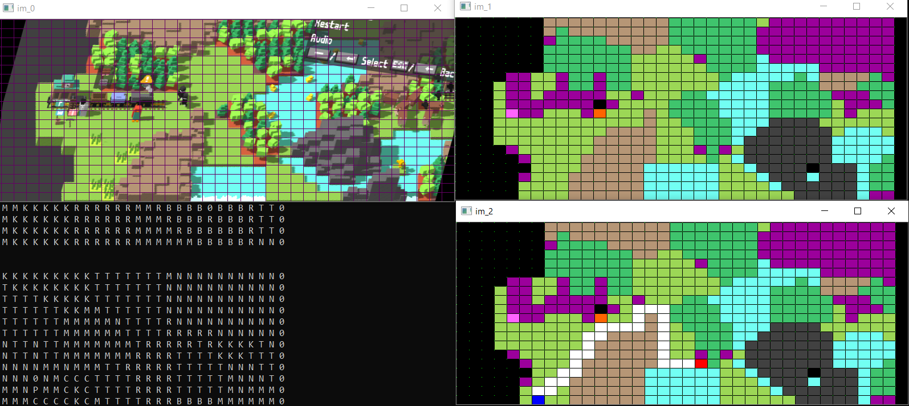

# Unrailed_Bot
## Quick Presentation

Unrailed! is a Video Game available on steam [there](https://unrailed-game.com/) :

I decided to make a bot to play the game with an AI.

+ [Brice PARENT](https://github.com/Naexys)

My friend helped me to clean the repo. Cheers.

+ [Léo BENITO  ](https://github.com/TrAyZeN) 

## Pictures

### The computer vision

### The transcription of its vision and the pathfinding

### The computer playing

## Video

[Unrailed AI!](https://youtu.be/Hu6cn4zaFlU)

## Get started

* `launch "Unrailed!"`
* `set the resolution to 800x600 px`
* `set the quality to medium`
* `set the first player to the orange Penguin`
* `git clone https://github.com/Flowtter/unrailed-ai.git`
* `pip install -r requirements.txt`
* `cd Unrailed_AI/src`
* `python main.py azerty` or `python main.py qwerty`
* `you may have to change in the constant.py file AXE_TRESH, PICKAXE_TRESH, HSV_PLAYER`
